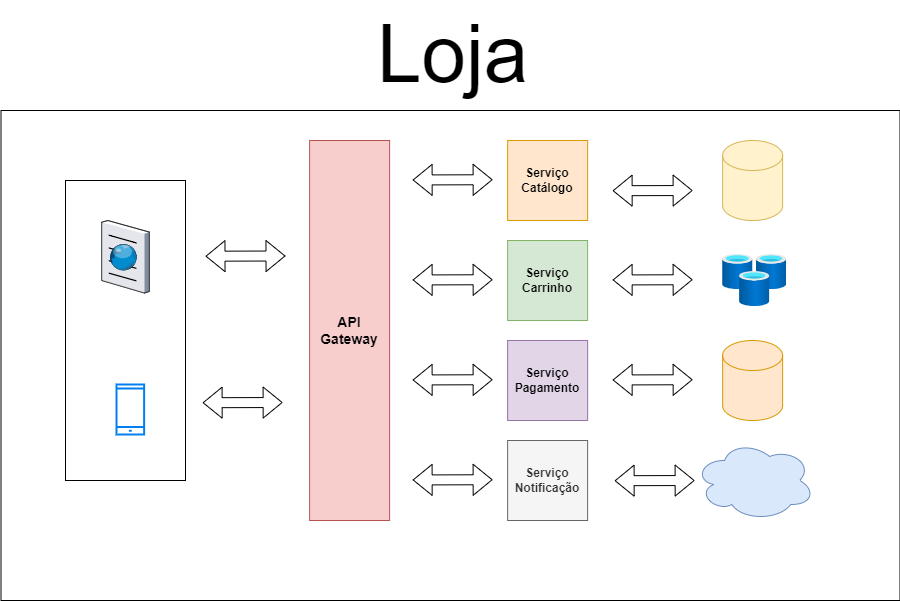

# Descricao de Microserviços
Microsserviços vem de uma abordagem arquitetural para desenvolver uma aplicação como um conjunto de pequenos serviços independentes, cada um executando um processo específico e se comunicando entre si por HTTP ou RPC, geralmente com APIs RESTful. Cada microsserviço deve ser autônomo implementando uma única funcionalidade da aplicação.

Essa arquitetura é contrária à tradicional monolítica, em que toda a aplicação é desenvolvida como um único código-fonte. Com os microsserviços, cada serviço pode ser desenvolvido, implantado, escalado e atualizado de forma independente, o que pode resultar em maior flexibilidade, escalabilidade e facilidade de manutenção.

Um exemplo de uma aplicação de microsserviços pode ser uma loja online. como mostrado abaixo:

- Serviço de Catálogo: Responsável por gerenciar os produtos disponíveis para venda.
- Serviço de Carrinho: Gerencia os itens adicionados ao carrinho de compras.
- Serviço de Pagamento: Responsável por processar os pagamentos.
- Serviço de Notificação: Envia notificações sobre o status do pedido.

Cada um desses serviços seria um microsserviço independente, com sua própria base de código, banco de dados e responsabilidade específica. Eles se comunicariam entre si conforme necessário, como mostrado no diagrama abaixo:

Cada serviço pode ser desenvolvido e escalado independentemente, permitindo que a aplicação como um todo seja mais flexível e fácil de manter.
